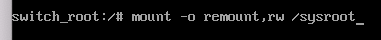

# RHEL / Centos

```
systemctl list-unit-files
```

#### Get version of linux OS

```
> lsb_release -a
```

### Recover root password (Rhel/ Centos)

```
#hit e during reboot
#add 
rd.break
# at end of linux or linux16 line
# enter following command (also see screenshot below)
mount -o remount,rw /sysroot

# Type chroot /sysroot to make this folder new root directory.
chroot /sysroot

# change the root password
passwd

# SELinux must be taken care of. If not, contents of /etc/shadow will be messed up.
touch /.autorelabel

### NOTE you could also do the following instead
load_policy -i 
chcon -t shadow_t /etc/shadow

#  exit out 2x
exit
exit

# will reboot and you can use your new password
```


